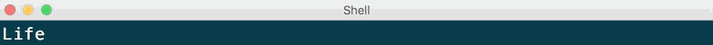

# Consome = Console + Awesome :raised_hands:
Add a logAt(index, message) function to your NodeJS console.


## Install

```sh
yarn add -D consome
```

or

```sh
npm i -save-dev consome
```

## Basic Usage
```js
require('consome');
console.logAt(0, 'logging something at line 0');
console.logAt(2, 'logging something at line 2');
```

## Demo
Let's implement a dynamic terminal loader:
```js
require('consome');

console.log('----- Demo -----');

const loadingLine = console.log('Loading');
setInterval(() => {
  console.logAt(loadingLine, `Loading ${loader.next()}`)
}, 500);

console.log('----- Fin -----');
```
### Result

