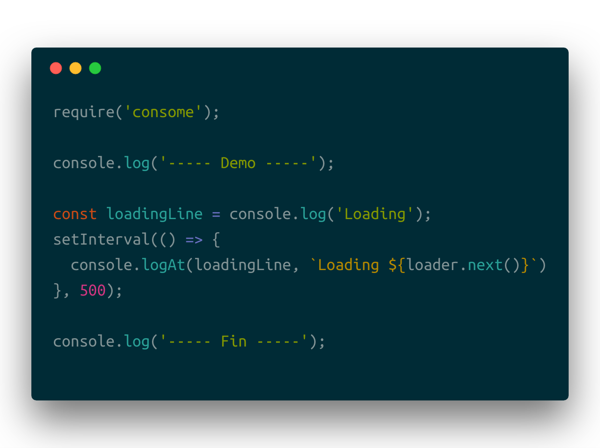

# Consome = Console + Awesome :raised_hands:



Add a logAt(index, message) function to your NodeJS console.

## Install

```sh
yarn add -D consome
```

or

```sh
npm i -save-dev consome
```

## Result

